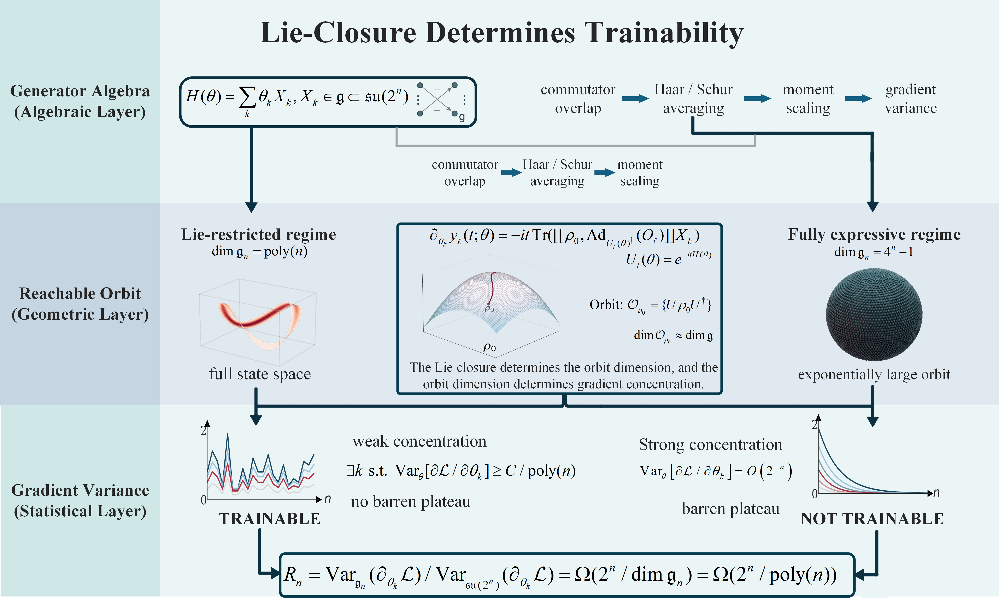
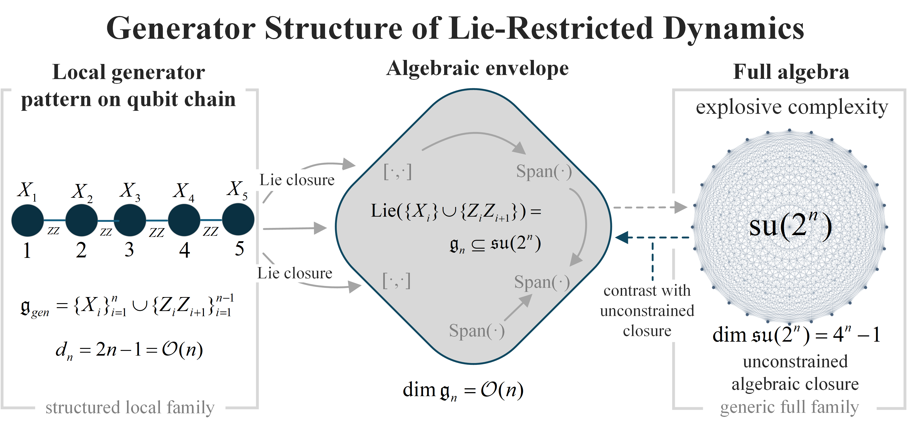

# Lie-Geometric Trainability of Quantum Dynamical Systems

[]()
[]()

Official implementation for

**Lie-Geometric Trainability of Quantum Dynamical Systems: Avoiding Barren Plateaus via Low-Dimensional Lie Subalgebras**

*Physics Scripta (Accepted Manuscript, 2026)*

DOI: https://doi.org/10.1088/1402-4896/ae7d6d

---

## Overview

This repository provides numerical experiments supporting the theoretical framework developed in the paper.

The central conclusion is:

> **Lie closure determines trainability.**

The Lie algebra generated by the Hamiltonian controls the dimension of the reachable state orbit, which in turn determines gradient concentration and the emergence (or avoidance) of barren plateaus.

---

## Framework

<p align="center">
  
</p>

<p align="center">
  
</p>

The theoretical chain established in this work is

```text
Generator Algebra
        ↓
Lie Closure Dimension
        ↓
Reachable Orbit Dimension
        ↓
Moment Scaling
        ↓
Gradient Variance
        ↓
Trainability
```

---

## Main Results

### Lie-Restricted Regime

For a polynomial-dimensional Lie algebra

[
\dim(\mathfrak g_n)=\mathrm{poly}(n),
]

the gradient variance satisfies

[
\operatorname{Var}_{\theta}
\left(
\frac{\partial \mathcal L}{\partial \theta_k}
\right)
\ge
\frac{C}{\mathrm{poly}(n)}.
]

Therefore no barren plateau occurs.

---

### Fully Expressive Regime

For the full algebra

[
\mathfrak{su}(2^n),
]

the gradient variance obeys

[
\operatorname{Var}_{\theta}
\left(
\frac{\partial \mathcal L}{\partial \theta_k}
\right)
=======

O(2^{-n}),
]

which leads to exponential gradient concentration and barren plateaus.

---

### Variance Enhancement

[
R_n
===

\frac{
\operatorname{Var}*{\mathfrak g_n}
(\partial*{\theta_k}\mathcal L)
}{
\operatorname{Var}*{\mathfrak{su}(2^n)}
(\partial*{\theta_k}\mathcal L)
}
=

\Omega
\left(
\frac{2^n}
{\dim(\mathfrak g_n)}
\right).
]

---

## Repository Structure

```text
LieGeometricTrainability/
│
├── README.md
├── LICENSE
├── requirements.txt
│
├── framework.png
├── Generator_Structure.png
│
├── Main.py
├── Main_con.py
│
├── experiments/
│   ├── appendix_variance_experiment.py
│   ├── appendix_variance_experiment4.py
│   ├── appendix_variance_experiment5.py
│   ├── collective_spin_variance_experiment.py
│   └── initial_residual_scaling_experiment.py
│
├── data/
│   ├── lie_variance_results.csv
│   ├── full_variance_results.csv
│   ├── collective_spin_variance_results.csv
│   └── initial_residual_scaling_results.csv
│
├── figures/
│   ├── collective_spin_variance_summary.png
│   └── initial_residual_scaling_summary.png
│
└── docs/
    └── paper.pdf
```

---

## Experiments

### 1. Two-Qubit Sanity Check

File:

```bash
experiments/appendix_variance_experiment.py
```

Compares gradient variance between a restricted Lie algebra and the full algebra (su(4)).

---

### 2. Gradient Variance Scaling

File:

```bash
experiments/collective_spin_variance_experiment.py
```

Verifies:

[
\mathrm{Var}_{Lie}
==================

\Omega(1/\mathrm{poly}(n))
]

versus

[
\mathrm{Var}_{Full}
===================

O(2^{-n}).
]

Outputs:

```text
collective_spin_variance_results.csv
collective_spin_variance_summary.png
```

---

### 3. Initial Residual Scaling

File:

```bash
experiments/initial_residual_scaling_experiment.py
```

Validates Assumption IV.10:

[
\mathbb E_\theta |f(\theta)-y|^2
\ge \beta >0.
]

Outputs:

```text
initial_residual_scaling_results.csv
initial_residual_scaling_summary.png
```

---

### 4. Variance Ratio Analysis

Files:

```bash
appendix_variance_experiment4.py
appendix_variance_experiment5.py
```

Evaluates

[
R_n
===

\mathrm{Var}*{Lie}/\mathrm{Var}*{Full}
]

and compares numerical results with theoretical predictions.

---

## Installation

```bash
git clone https://github.com/Harmenlv/LieGeometricTrainability.git

cd LieGeometricTrainability

pip install -r requirements.txt
```

### Dependencies

```text
numpy
scipy
matplotlib
pandas
tqdm
```

---

## Reproducing Results

Run

```bash
python Main.py
```

or

```bash
python Main_con.py
```

Generated outputs include:

* CSV result tables
* Variance scaling figures
* Residual scaling figures
* Variance-ratio comparisons

---

## Citation

```bibtex
@article{Shao2026LieTrainability,
  title={Lie-Geometric Trainability of Quantum Dynamical Systems:
         Avoiding Barren Plateaus via Low-Dimensional Lie Subalgebras},
  author={Shao, Haijian and Wu, Yujie and Deng, Xing and Jiang, Yingtao},
  journal={Physics Scripta},
  year={2026},
  doi={10.1088/1402-4896/ae7d6d}
  url={[https://iopscience.iop.org/article/10.1088/1402-4896/ae7d6d](https://iopscience.iop.org/article/10.1088/1402-4896/ae7d6d)}
}
```

---

## License

MIT License.

---

## Author

Harmen Shao

Independent Researcher

Research interests:

* Quantum Machine Learning
* Lie Geometry
* Quantum Control
* Quantum Dynamical Systems
* Quantum Trainability Theory

```
```
